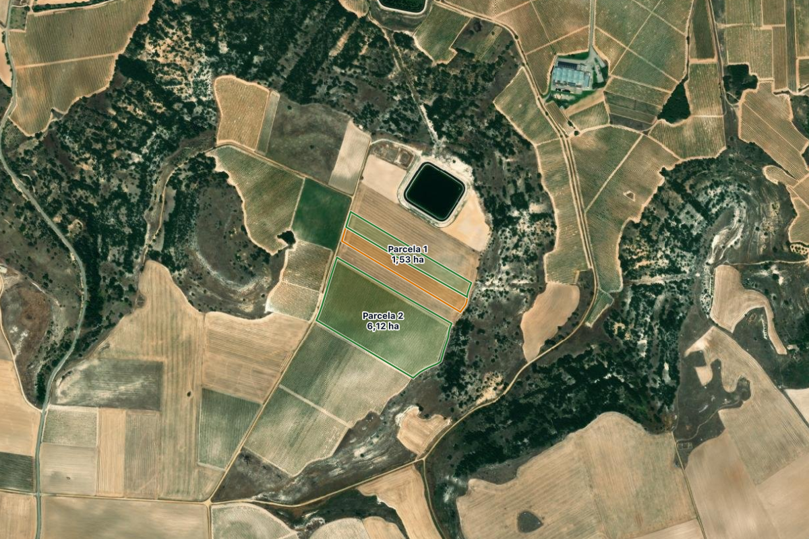
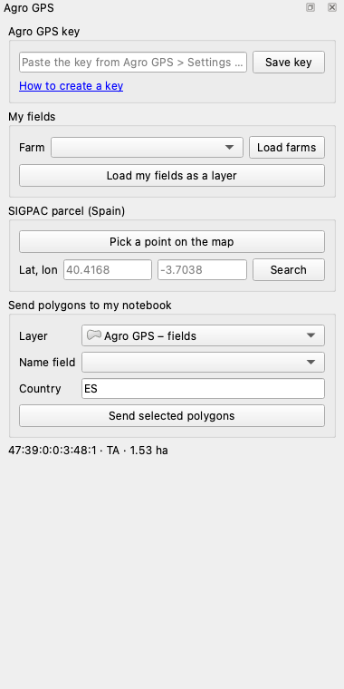

# Agro GPS for QGIS

QGIS plugin (QGIS 3.34 to 4.x) for [Agro GPS](https://agrogps.eu/en/), the digital farm notebook:

- **My fields:** load the fields of your Agro GPS farm, with crop and area, as a styled polygon layer.
- **SIGPAC parcel (Spain):** click on the map, or type coordinates, to add the SIGPAC agricultural parcel at that point (reference, land use, area, slope). Uses the public SIGPAC service of the Spanish Ministry of Agriculture; no account needed.
- **Send polygons to my notebook:** select polygons in any layer, pick the field that holds the name and the country, and they become new fields in your notebook.

A satellite basemap (Esri World Imagery) is added only when the project has none; the map switches to EPSG:3857 and frames the result with a margin.





*Both images are real QGIS 4.2.3 renders made by `scripts/qgis_smoke.py`; the fields layer uses real SIGPAC parcel outlines.*

## Your key

Loading and sending fields uses the Agro GPS web API (`https://api.agrogps.eu`), an external service run by The Hidden Panda. Create a key in the Agro GPS app: **Settings > API and webhooks**. A read key loads fields; a write key also sends polygons. The key is stored in your QGIS profile and only sent to `api.agrogps.eu`.

## Develop

```
python -m venv .venv && .venv/bin/pip install pytest pytest-cov
.venv/bin/python -m pytest              # core logic, no QGIS needed
python scripts/build_zip.py             # dist/agro_gps-<version>.zip
```

Headless check inside QGIS (renders `docs/map.png` and `docs/panel.png`, calls the live SIGPAC service):

```
QT_QPA_PLATFORM=offscreen <qgis python> scripts/qgis_smoke.py
```

Security scan of the zip exactly as plugins.qgis.org runs it (bandit, detect-secrets, flake8): see `docs/security-scan.txt`. All HTTP goes through `QgsBlockingNetworkRequest`, so the QGIS proxy settings apply.

MIT licence.
